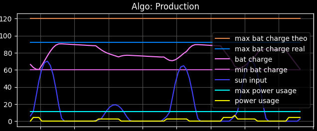
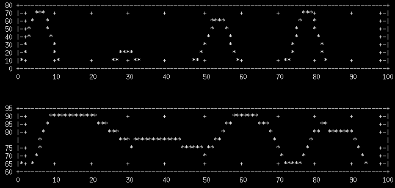
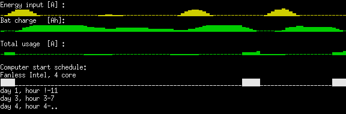
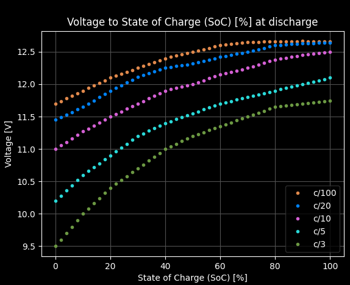
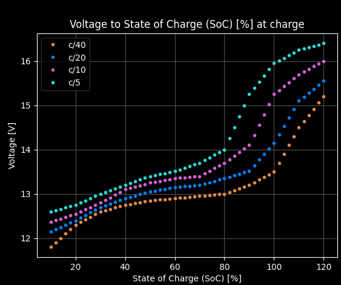

# SolOptXMR
Solar Optimal mining of XMR.

[FUNDRAISER for 2023](https://github.com/mj-xmr/SolOptXMR/issues/147). Please consider donating, if you'd like to see the project being developed further.


The goal is to create open-source software that aids people mining Monero with excess solar power (as well as other supplementing renewables) in the most profitable way. 
It will accommodate for issues such as:

- Time of day and month
- Weather fluctuations
- Amortizing the physical installation costs and optimally using the energy production
- Opportunistic scooping of hashes during network difficulty reductions
- Avoiding depleting/overcharging batteries below/abowe a threshold, that would damage them
- Avoiding overheating of the mining rig
- Leaving enough power for your daily use, that you declare

[Full project's description](docs/project-descr.md).

[Full description on Monero Community Crowdfunding System](https://ccs.getmonero.org/proposals/soloptxmr-mj-endor-2022.html), relevant only for one of the authors now.

# Requirements
- A POSIX system with a C++ compiler and Python3 interpreter. 
- Between 500 MB and 1 GB of RAM.

Supported Operating Systems:

| OS  | Support   |
| ------------- | -- | 
| Debian stable | ✓  | 
| Debian buster | ✓  | 
| Ubuntu 21.04  | ✓  | 
| Ubuntu 20.04  | ✓  | 
| Mac OSX 12    | ?  | 
| Mac OSX 11    | ?  | 
| Mac OSX 10.15 | ?  | 
| Raspbian      | ?  | 
| Windows       | X  | 

Legend:
- ✓ : Full support or there are bugs that are fixable
- ? : Should work but some more testing is required
- X : No support yet, but is being planned

# Quickstart
In case these instructions become outdated, please refer to the steps of the [CI](.github/workflows/linux.yml).

## Preparation
Please run the below scripts. They are meant to be non-interactive and will require root permissions (via `sudo`). 
When in doubt, please view their contents with `cat` for an objective assessment of their functionalities.
```bash
git clone --recursive https://github.com/mj-xmr/SolOptXMR.git # Clone this repo (assuming it's not a fork)
cd SolOptXMR		# Enter the cloned repo's dir
git checkout $(git describe --tags $(git rev-list --tags --max-count=1)) # Checkout latest tag (master is risky)
./util/prep-env.sh	# Prepare the environment - downloads example data and creates useful symlinks 
./util/deps-pull.sh	# Download the maintaned dependencies
./util/deps-build.sh	# Build and install the unmanaged dependencies (uses sudo for installation)
./util/config.sh	# Configure your rig
```

## Building & running
```bash
./ci-default          # Build and run the tests
./soloptxmr.py        # Run the prediction with default parameters
./soloptxmr.py --help # Print all the available options 
```
By default the script performs the predictions 3 days ahead from now, assuming the battery charge at its reasonable minimum, set by the `battery.json`.

### Fine configuration
In order to alter the default behavior, the main script can be ran with the following example options:
```bash
./soloptxmr.py \
--days-horizon 5 \
--battery-charge-percent 78 \
--start-date 2022-02-20T20:22
```
or equivalently:
```bash
./soloptxmr.py \
-d 5 \
-p 78 \
-s "2022-02-20 20:22"
```

More examples can be found under [use cases documentation](docs/use-cases.md).

### Simple battery charge input via voltage and OCR
Setting the battery's voltage directly, also via OCR, rather than the Ah or % charge is a feature currently being worked on. What's missing are measurements of batteries of various types, like in [Example 1](http://www.scubaengineer.com/documents/lead_acid_battery_charging_graphs.pdf).

```bash
./soloptxmr.py --battery-charge-v 12.3 # Set the voltage of your battery to be converted to its current charge
```

or for OCR:

```bash
./soloptxmr.py --battery-charge-ocr    # Use image recognition to read the current battery voltage
```

It is recommended to perform the voltage measurements only when the batteries aren't being charged (like: before the sunrise), as this delivers a more objective value. 
It this is not the case, you may enter the current charging voltage, which will be higher than the discharging voltage, but you need to let the system know of the fact with the `--charge-status charging` option, or its shorter form: `-c c`. 
Bear in mind, that the charging voltage will react on the actual alterations of the voltage of the input itself - clouds & Sun's position. 
For this reason, it's hardly an objective measurement.


### OCR
It's possible to automate the process of reading the battery voltage, or % of charge directly, after capturing a picture of an LCD display and passing the picture to an OCR module. [See here](docs/ocr.md) for a more detailed description.

## Automation
Upon a successful execution of the `./soloptxmr.py` script, you will be presented with a set of scheduled commands for you to review.
If you're satisfied with the proposal, you may execute the commands (thus scheduling them) individually by copy-pasting them, or you may accept all of them in one go, by simply executing their file-stored version via `sh`.
For example:

```bash
echo "wakeonlan C0:FF:EE:BA:BE:BB" | at 11:00
echo "ssh -o ConnectTimeout=60 -n ryzen8 'hostname; systemctl suspend'" | at 18:00

Saved commands to:
/home/yoname/temp/solar/sol-cmds.sh
```

In the above case, to schedule the displayed commands in one go, you'd simply execute: 

```bash
sh /home/yoname/temp/solar/sol-cmds.sh
```

It's advised to perform the simulation and the subsequent scheduling each morning and before the sunrise, as only then the voltage measurement is unaffected by the charging process, and the battery's state of charge is closest to the reality of the new day, rather than simply being assumed by the simulation ran at the previous day. 

In order for these commands to have any effect, some deal of preparation is needed, that is described in the [automation docs](docs/automation.md).
That section contains elaborated instructions on how to prepare both the mining nodes and a PC designated to control them.

As far as your trust towards the system is concerned, the section [testing](docs/testing.md) presents the currently handled, and automatically tested corner cases.

## Configuration
After running the `./util/config.sh` script, you'll be presented with paths to configuration scripts, that have just been copied to your `~/.config` directory. 
You're meant to adjust them to match your specifics. 
[Please read this file](docs/config.md) for further explanations.

# Extra scripts

## Modeling solar arrays
The script `src/arrays.py` will help you understand how a mixture of various orientations of arrays, defined via `~/.config/solar/arrays.json` reduces the peak & trough problem. 
By properly diversifying the orientation, you'll be blessed with more stable input across the day. 
Depending on your location, this might increase your profits of the sold electricity, that you can't use domestically nor on mining, since the buyback prices might be a function of the time of day.

You might also discover, that although the recommended panel tilt of 45° does deliver more production in total across the whole year, it also creates as much of overproduction during the summer, that you'll have a hard time using due to high temperatures and low buyback prices, as low underproduction it delivers during winter, when you need the power the most. 
In order to balance this discrepancy, please try experimenting with more vertical tilts, like between 89° and 80°.
The script accepts an iso-formatted date as an input, allowing you to simulate extreme conditions - winter and summer. 
The title of the plot presents the sum of produced electricity in a given day. 
It makes sense to compare and sum up this values for the extreme conditions.

## Voltage plots
To visualize the currently modelled (dis)charge rates, as described [in this paper](http://www.scubaengineer.com/documents/lead_acid_battery_charging_graphs.pdf), dubbed _C/100_, _C/20_, and so on, please run the `src/voltage_plot.py` script.

## Working with the scheduled jobs
Executing the script `./util/jobs-query.sh` will print any scheduled jobs, that you decided to execute after the calculations and reviewing their result. 
The script's special ability is presenting the output of the `at` command in a simplified form.
Obviously it should be ran from the machine, where the schedule has been set.

If you're unhappy with the result, you may use `./util/jobs-remove-all.sh` to clear the queue, or simply `atrm JOB_NUMBER` to remove individual jobs, where the `JOB_NUMBER` can be obtained via the `./util/jobs-query.sh` script.

# Further documentation
- [project's description](docs/project-descr.md): detailed description of the project and the motivation behind it.
- [safety](docs/safety.md): how to handle electrical systems safely. Tell me, that you "read and understood it", and I can sleep fine.
- [config](docs/config.md): how to configure your instance of the project
- [use cases](docs/use-cases.md): lists various ways of interacting with the software
- [ocr](docs/ocr.md): deeper instructions on how to use and extend the OCR capabilities
- [automation](docs/automation.md): how to automate the system
- [testing](docs/testing.md): all about testing and a visual demo of special corner cases
- [economy](docs/economy.md): my economy views and the resulting dynamics tailored to production of electricity & mining crypto.
- [archive](docs/web-archive): crucial documents gathered from various sites, that deliver expert knowledge

# Screenshots

## First production model
A model with an integrated n-day weather prediction & multiple, user-defined mining rigs (here: 2), simulating the battery drainage with a horizon of 5 days:


## Alternative plots

Below is the standard Python plot:



The same plot can represented in alternative ways for systems or remote connections, where Python plotting isn't available. 
First the gnuplot-iostreams console output is presented, that mimics the energy input cycles, as well as the battery charge from the above Python plot accordingly:



Yet because it's quite cumbersome to install the gnuplot's dependencies under Windows and because these kinds of console plots take a lot of space to be printed in a readable form, the below dependency-free ASCII representation is also being used:



This kind of ASCII plotting yields a very quick and compact way to deliver multi-layered information in just one screen area, that might be currently visible to you.

## Network difficulty
These data are taken into account when making decision about starting a rig or not. 
Sometimes it's worth to wait for a while until other miners switch off their rigs in order to scoop more coins for the same amount of used power. 
Obviously this assumes, that your stored electricity doesn't go to waste. 
Also, please note the differences in scales of the two plots. 
The daily seasonal swings (lower plot) are 100 times smaller than the mean reversion ones (upper plot).


On top of higher individual gains, collectively, scooping the hashes this way also improves and stabilizes the network's security.

## Solar array modeling
An example evaluation (via `src/arrays.py`) of 2 sets of panels - one set pointing to south-east and the other to south-west. 
Please note the prolonged production across the whole day, reflected by the inverter's wide output.


## Lead-acid battery (dis)charge profiles
The currently modelled (dis)charge profiles:





## OCR and generic image recognition
These kinds of images are able to be successfully recognized:

Translates into the displayed number:


Similar as the LCD above but notice, that this one is backlit, the removal of which requires an additional inversion step:


Using custom code, translates into percentage - in this case 100%, since all the relevant rectangles, namely the ones representing the battery charge, are lit:


More [examples here](src/data/img).


## Console interactive UI (WIP)
Accessible via `ssh`/`putty`, based on `curses`.


## Profitability calculation

```
Algo name:  Endor
Undervolted initial =  0.64%
Undervolted =  4.32%
Overvolted  =  25.99%
Total hashes = 175.83 MH
Total income = 34.64 USD
Total cost = 6.29 USD
Total profit = 28.35 USD
Profitability = 450.72 %
Saving figure to: build//fig-Endor.png
```

## Star history

[](https://star-history.com/#mj-xmr/SolOptXMR&mj-xmr/tsqsim&Date)

