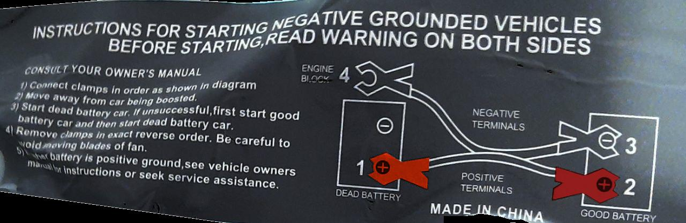
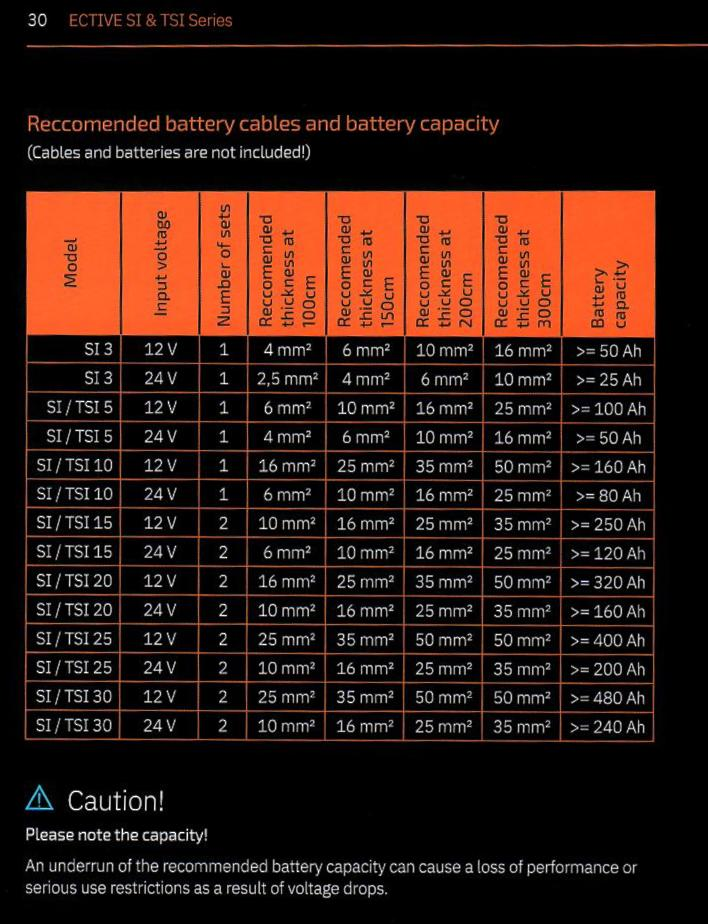
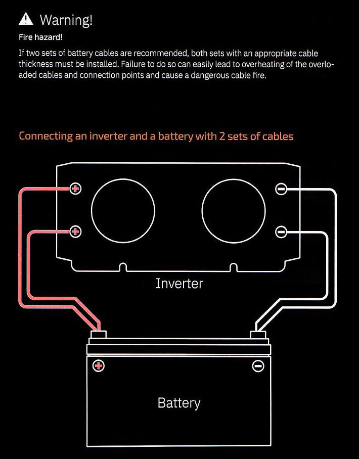
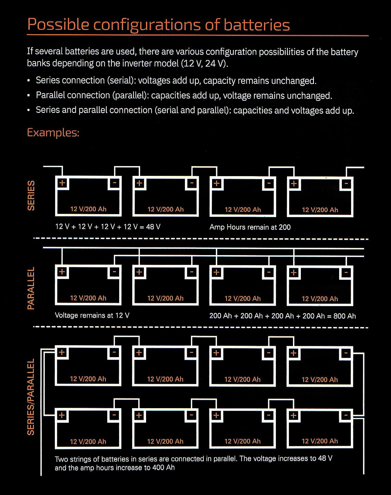

# Safety
This section describes safety considerations, subjectively sorted by the most important to the least important. Please read the section, even if most parts sound obvious to you.
Bear in mind, that I'm not an electrician and I can't take legal responsibility for injuries or financial damages, that I might cause by giving you wrong advice. 

## Glossary
- V - Volt (as an SI unit) or Voltage
- DC - Direct Current: produced by the renewables. Usually describes systems sharing the common voltage of 12V, 24V or 36V. This is also the type of current stored within the batteries (lead-acid, LiFePo4, etc.).
- AC - Alternating Current: The sinusoidal "household" current produced by the Inverter, accepting the DC as its input. The AC comes in 230V in the EU or 110V in Canada (TODO: Anywhere else?). The sinusoidal nature of this current allows it to generate sqrt3 (???) more power than the DC of the same voltage would.
- SC - Short Circuiting (see below)

## Short Circuiting (SC)
SC means connecting (+) and (-) to each other while there's energy stored or being produced, that would cause the electricity to flow between them. 
If this doesn't cause death or injury, it could at least damage your hardware. 
A SC can be caused not only by connecting the nodes directly, but also indirectly, when you for example touch the (+) and the (-) with your hands simultaneously. 
In such case, the charge passes right through you and definitely causing harm.
Unfortunately a similar situation might occur, if you touch the (+) and are standing on the floor, without shoes, that would otherwise serve as isolation. If the floor is wet, it worsens the situation. 

## Terminals: connecting and disconnecting
When connecting and disconnecting terminals the following rules apply, that minimize (though not eliminate) the risk of an electro shock: 
- connecting: connect + first (red), then - (black)
- disconnecting: disconnect - first (black) then + (red)

Or as a rule of thumb easy to remember: the + (red) can always be connected alone.
The same rule applies to all the other bipolar connectors as well.

### Advanced and generic terminal handling
Below is a colored diagram that represents a generic procedure of connection of 2 elements - 
a charged battery and a dead battery, the latter of which may serve as an alias for an energy consumer. 
If it's only possible, "the consumer" should be switched off during the act connection. 

As before, the disconnection should proceed in exactly the opposite order of the connection. 

Notice the irrelevant (to our case), instruction to connect the negative terminal to an engine's block for grounding. 
We'd rather connect it to the negative pole of an inverter.
Just for completeness sake, [here's a better explanation (YT)](https://www.youtube.com/watch?v=THvk09liu00) of the nuance.

## Voltage of the system
The general rule is, that from the safety perspective's alone, the lower the voltage, the safer the system is.
While a 24V system delivers slightly more economic alternative (in an optimistic case) to the safer 12V system, it might not be worth it, especially if you have nasty kids running around.

## Fire extinguishers
We recommend keeping at least a small fire extinguisher (FE) near the batteries, MPPT controller and the inverter (in that order). 
Make sure that the FE is suitable for dealing with electrical devices. You can buy FE rated up to 1000V rather cheaply. 
Except for the inverter, which produces 230V AC, the remaining parts of the system are mere 24V DC at best, if not the recommended 12V DC.
In case of a fire event, make sure to keep as much distance to the device being extinguished as possible, as this reduces your risks. 
Use only short bursts of the extinguisher's material and observe the reaction. 
Keep in mind, that the material stored in an FE's tank is quite time limited and would suffice for only up to a minute of a continuous burst. 
After the event make sure to move all the electronic hardware away from the place, where you were using the FE, as the FE's material is highly corrosive.

## MPPT cutoff voltage
The MPPT controllers cut off any input that would exceed the maximal voltage, that you may set to prevent your batteries from overloading.
Overloading of the batteries leads not only to a temporary shut down of the inverter, but to such an increase of the batteries' internal temperature, that their liquids start to boil. 
Obviously this accelerates corrosion but leads to other unwanted effects as well, like toxic and flammable gas emissions and consequently such an increase of the internal pressure, that they might leak or even explode.
I personally set my maximal voltage to 13.4V for a 12V system.

## Battery conservation - protective goggles
In the case of calcium batteries, their conservation involves refilling their cell(s) with a tiny dose of distilled water.
The reason for this requirement is that as the batteries' internal temperature rises, the electrolyte evaporates.
In order to refill the electrolyte, one of the screws on top of the battery has to be unscrewed. 
**Before staring to unscrew the screws put on protective googles**.
The reason for this is, that depending on how much cumulative overheats the batteries had to experience, so will be the built up pressure inside. 
This pressure will find its way out as soon as you start unscrewing the battery.
At the same time the air will typically contain traces of the electrolyte, that can be dangerous to your health.
Don't look at the burst with your remaining eye.
Obviously protective gloves also wouldn't hurt.

## MPPT reaction time
Bear in mind, that they react with a delay, so if you set the voltage high but still, say, 1V below the maximal sane batteries' voltage (14V vs 15V), exceeding of which would temporarily shut down your inverter, the delay in reaction of the MPPT controller may still lead to overvoltage, as defined by the inverter. 
This is very apparent during days with low clouds with gaps, resulting in switching your panels on and off multiple times. 
The reason for this confusion is, that as soon as the battery is >80% charged, the voltage starts raising much faster with the same energy input, therefore the previous assumptions of slower growth and adjusted reaction time don't hold anymore.
Below you can see the typical charge profiles of lead-acid batteries, where above the ~80% charge, you may experience the sudden non-linearity of voltage, that confuses the MPPT controllers.

In case your MPPT controller does lead to shutdowns of your inverter anyway, a good solution is a light UPS, connected as one of the users of the inverter. 
I've had very good experience with `APC SurgeArrest®`, model `BE325`, which consumes little instantaneous power during charging, so that the inverter can easily handle it.

## Cable sizes vs current
It should be noted, that the low voltages typically associated with the DC, suffer from being unable to be "pushed" through narrow cables for even moderate distances. 
As an analogy, try think of a decent volume of water trying to be pushed trough a pipe. 
The pipe would have to be wide enough to be able to accept that larger volume of water. 
The producer of the inverter that I bought, provides the following sheet, that quantifies the above relationship: 

As you may conclude, we aren't really talking about long distances, that can be serviced at such low voltages of the DC current.
A consequence of violating these limitations are:

- an instability between the input MPPT controller and the batteries, leading to a slowdown of its reactions, hence instability
- a loss of voltage available to the inverter w.r.t. what the current charge of the batteries might be, ultimately leading to a lower available Wattage, that the inverter can deliver to the end consumers
- an overheat of the abused (narrow parts of) cables and possibly a fire event 
 
This might be one reason for you to consider a 24V system, as it increases the cables' tolerance (see the table again). 
Another reason would be suffering fewer losses during the conversion from 24V DC up to 230V AC, compared to the conversion from 12V DC up to 230V AC. 

## Cables parallel

You've probably noticed the 3rd column of the table presented in the "_Cable sizes_" section, titled "_Number of sets_". 
It depicts the relaxed cable parameters under the condition of an optional, additional, parallel connection of the cables between the batteries and the inverter's two pairs of terminators. 
Conceptually, the connection would look like on the following picture:

Please take a special note of the _Fire Hazard_ warning: the need of using pairs of cables of only __the same__ thickness. 
It describes a special case of what has already been described in the "_Cable sizes_" section, where the "_(narrow parts of) cables_" were mentioned. 
Here the "_narrow part_" would simply be the entire pair of the narrower parallel cables.  

## Cables configurations

TODO: description & maybe move somewhere else as it's not safety related?

## Chain of safety and responsibility
After mounting a somewhat powerful set of energy related devices, you automatically take some responsibility for keeping if fault free, else you risk fire and explosion. 
The solar panels will keep producing the electricity regardless of whether you can use it or not. 
The excess energy is being buffered in the batteries. 
In the event of overcharging the batteries, the MPPT controller dissipates the excess energy in form of heat via its quite large radiator. 
Imagine the extreme situation, which happened to me: 

- you leave the apartment for a week
- the Sun shines for the entire time, thus producing both energy via your panels and increases the air temperature by a lot
- your batteries get charged to 100% in just one day of your absence, but
- you forgot to schedule the automated mining.

The consequences are the following:

- the batteries have no chance to dissipate the excess energy and the MPPT controller has to dissipate it 12 h/day while it's already very hot
- after just 3 days of working overtime and in extreme conditions the MPPT controller's internal electronics starts to melt down
- the MPPT controller malfunctioned electronics can't read the battery voltage anymore and assumes it's 0
- the MPPT controller stops dissipating heat and pushes all it has to the batteries
- the batteries start to boil, leading to sulfation, in case of Lead-Acid batteries, and risk an explosion, especially if somebody around is having a smoke, or worse, in case of Lithium batteries, *almost guarantee* an explosion.

As you might conclude, there's a chain of responsibility there: Panels -> MPPT -> Batteries -> Mining rigs. 
If any of them fails, the prior one tries to take over, until it can't. 
That's why scheduled mining is not only a way of making some money, but also a flexible safety procedure. 
Even if a given desktop computer doesn't mine at all, if it can only be switched on just to consume 50 W in its idle mode, these are 50 W, that the MPPT controller doesn't have to dissipate, thus reducing a risk of its failure in the long run. 
Or in other words: the energy dissipation is being offset, quite like a hot potato, to a different entity that is able to handle it at a given span of time. 
 
My Lead-Acid batteries broke down in the process, but in the end, I was able to repair them with a relatively cheap (~50$ as of year 2022), but reliable rectifier from China. 
Another conclusion to draw here is, that there are usually solid reasons why such installations catch fire, rather than them being purely random events. 

Fingers crossed!

# Appendix
## Online resources
- [Cable sizes vs current](https://www.spwales.com/cable-size-current-rating-chart) - TODO: explain
- [Lead-Acid charging graphs](http://www.scubaengineer.com/documents/lead_acid_battery_charging_graphs.pdf)
