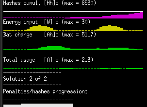
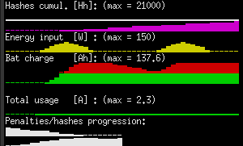
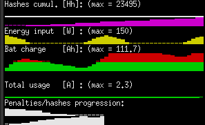
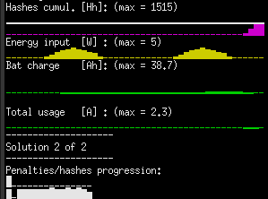
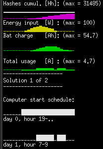
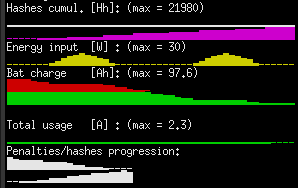
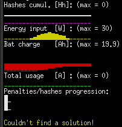
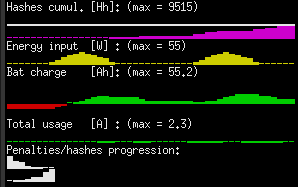
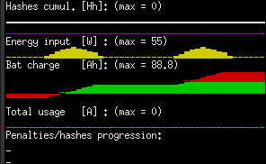
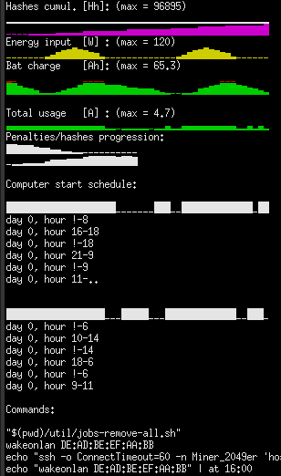

# Testing

## Intro
The below testing results are achieved via the following testing executables:

- `opti-system-min-test`
- `opti-system-long-test`

## Corner cases

In this section the corner cases are presented, that have been isolated so far, together with their short description. 
This should help the user assess the current robustness of the system.
The expectation of the system on corner cases is to at least exit cleanly, preferrably provide a solution, that minimizes the damage, that might be inevitable.

### Happy path

The Hello World of testing. 

If anything is supposed to work, it's the happy path - the most optimistic setup, in which the system can operate. 
In our case this is achieved with all of the main components adjusted so, that they remain in such a balance, that no emergency handling needs to be enabled. 
The main components are:

- solar panels as input
- batteries as a buffer, large enough to store the input
- computers as the consumers

The Penalities/hashes progression depicts how these values decreased / increased accordingly, across the progressing iterations of the simulation. 
While the hashes value is self-explanatory, the penalities constitute of under- and overvoltage counting of the batteries. 
This translates to battery damage in both cases and wasted energy in the case of overvoltage alone.

### High input

The solar panels deliver so much energy, that neither the batteries can store it, nor the computer is able to fully take it away.
Although it will try later, the computer first waits some time before it starts, not to undervolt the batteries, which damages them.

### High input noon

The same as above but the simulation starts from noon.
This allows to track if the computers started right at the beginning to reduce the inevitable overvoltage.

### Low input

With the wattage as low as 5W peak, it's interesting to see if the system is able to try to mine anything while keeping the batteries above the minimum.

### 2 computers on one day

Assuming enough wattage is being produced, here we try to run 2 computers simultaneously.
Below the individual computers' schedules are printed.
See how their overlap is summed up in the `Total usage` plot

### Overcharged batteries

The simulation starts with severly overcharged batteries.
Instead of panicking, we try to dissipate the energy immedately and even spare some of it at the end of the simulation.

### Undercharged batteries

For the entire day the batteries were so undercharged, that the optimal solution doesn't include starting the computer for any period of time.
In the Penalities/hashes progression plot you may see, that in one of the 1st solutions the mining was indeed considered, but we ended up rejecting this idea due to high penalities associated with even more undervoltage, measured quantitatively.

As you may see, beneath there's a warning produced, yet the application exits cleanly.

### Undercharged batteries but mining

The day starts with undercharged batteries, but as soon as enough energy is amassed, the computers are being started to turn the night into a day.

### No computers

A very special case, when the `--no-computers` or its shorter version: `-cn` command line option is selected. 
In such case, it's not even being considered to run any computers for the mining, but rather taking the pre-defined habits into account only.
This option serves as a simple and fast weather prediction forecast, showing its impact on your batteries.

### 2 computers - 2 days

More complex, yet more common case, where 2 computers are being used and the balance between the under- and overcharge is kept.
Please note, that the more computers are used, the more combinations are possible and that - non linearly.

Below the schedule the shell commands are printed, that, assuming a proper configuration in the `computers.json`, may be directly copy-pasted to the controlling computer.

